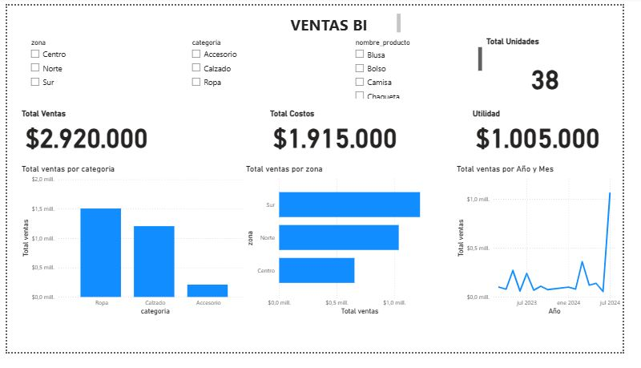

# 🔗 Análisis de Ventas con Python + MySQL + Power BI

Proyecto de análisis de datos de ventas, usando conexión directa a MySQL con Python para automatizar la extracción y exportación de datos. El objetivo es aplicar un modelo de datos y visualización profesional con Power BI.

---

## 🎯 Objetivo

- Automatizar la extracción de datos desde una base de datos MySQL.
- Unir datos de hechos y dimensiones mediante `JOIN`.
- Exportar los resultados a Excel.
- Crear un dashboard interactivo en Power BI.
- Simular un flujo completo de actualización de datos.

---

## 🛠️ Herramientas usadas

- Python (pandas, mysql-connector, openpyxl)
- MySQL (modelo estrella: hechos y dimensiones)
- Power BI Desktop

---

## 📁 Estructura del Proyecto

📂 PYTHON + MySQL + Excel
│
├── conexion_mysql.py # Script principal: conexión, consulta y exportación
├── paquetes.txt # Paquetes del entorno virtual
├── README.md # Documentación del proyecto
├── ventas_bi.pbix # Archivo Power BI con el dashboard
├── ventas_combinadas.xlsx # Archivo exportado con datos combinados (JOIN)
├── 📁 imagenes # Captura del dashboard para README
└── 📁 venv # Entorno virtual de Python

## 📸 Vista previa del Dashboard

